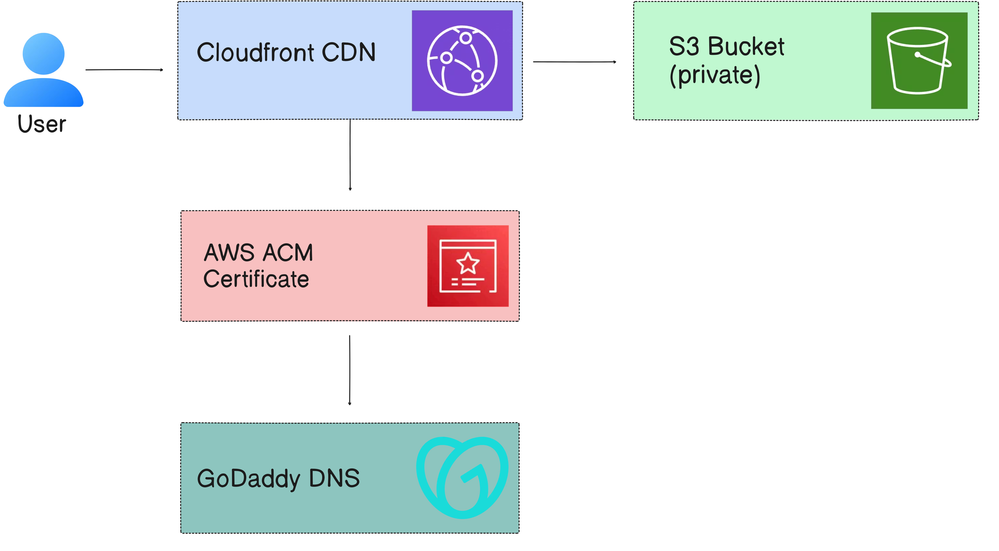

# 🚀 Deploying a Secure Static Website on AWS Using S3, CloudFront, ACM, and GoDaddy  
### A Complete Step-by-Step Guide

Hosting a static website on AWS is simple — but hosting it **securely**, with **HTTPS**, **global CDN caching**, and a **custom domain**, requires a few extra steps.

This repository documents the complete end-to-end process of deploying a **secure, high-performance static website** on AWS using:

- **Amazon S3** — private bucket for hosting static files  
- **Amazon CloudFront** — global CDN for speed & caching  
- **AWS ACM** — free SSL certificates for HTTPS  
- **GoDaddy** — domain registration & DNS management  

This guide follows **AWS best practices**, including **Origin Access Control (OAC)** for secure S3 access.

---

# 📌 Features

- 🔒 Fully private S3 bucket  
- 🌍 CloudFront CDN with global caching  
- 🔐 HTTPS enabled using ACM SSL certificates  
- 🏷 Custom domain from GoDaddy  
- ⚙️ Secure access using OAC  
- ⭐ Zero servers to manage  
- 💰 Extremely low hosting cost  

---

# 🏗 Architecture Overview

## 📌 Architecture Diagram

<p align="center">
  
</p>


This architecture ensures:

✔ Secure access  
✔ High performance  
✔ Global latency reduction  
✔ Custom domain + HTTPS  
✔ Minimal operational overhead  

---

# 🧩 Step 1 — Create an S3 Bucket (Private Hosting)

### 1️⃣ Create a New Bucket

1. Go to **AWS S3 → Create Bucket**
2. Bucket name example:  yourdomain.com
3. Ensure:
- **Block Public Access = Enabled**
- ACLs disabled
4. Upload website files:
- `index.html`
- CSS, JS, assets
5. Keep **Static Website Hosting = Disabled**

> CloudFront will deliver content from this private bucket.

---

# 🔐 Step 2 — Request a Public SSL Certificate (ACM)

CloudFront accepts certificates **only from the `us-east-1` region**.

### Steps:

1. Open **AWS ACM (N. Virginia)**  
2. Request a **Public Certificate**
3. Add domains:
   yourdomain.com
   www.yourdomain.com
4. Select **DNS validation**
5. ACM generates two CNAME records  
6. Keep the page open

---

# 🌐 Step 3 — Add DNS Validation CNAME Records in GoDaddy

1. Open **GoDaddy → DNS Management**
2. Add both ACM CNAME records:

Example:
Type: CNAME
Name: _abc123
Value: _xyz.acm-validations.aws.

**Important Notes:**
- Do **not** modify values
- Do **not** add your domain manually  
- GoDaddy appends `.yourdomain.com`

Within 5–30 minutes, ACM will update to **Issued**.

---

# 🚀 Step 4 — Create a CloudFront Distribution

## 4.1 Configure the S3 Origin

- **Origin Domain** must be:
yourbucket.s3.amazonaws.com
- NOT:
s3-website-region.amazonaws.com

- Leave **Origin Path empty**  
- Enable **Origin Access Control (OAC)**

## 4.2 Cache Behavior Settings

- Viewer Protocol Policy: **Redirect HTTP → HTTPS**  
- Allowed Methods: `GET`, `HEAD`  
- Cache Policy: **CachingOptimized**

## 4.3 Add Domain Names (CNAMEs)

Add:
yourdomain.com
www.yourdomain.com


## 4.4 Attach SSL Certificate

Choose the ACM certificate created earlier.

## 4.5 Default Root Object

Set:
index.html


Create the distribution.

Propagation time: **5–10 minutes**.

---

# 🔑 Step 5 — Apply CloudFront Bucket Policy (OAC Access)

CloudFront generates a required bucket policy such as:

```json
{
  "Version": "2012-10-17",
  "Statement": [
    {
      "Effect": "Allow",
      "Principal": { "Service": "cloudfront.amazonaws.com" },
      "Action": "s3:GetObject",
      "Resource": "arn:aws:s3:::YOUR_BUCKET/*",
      "Condition": {
        "StringEquals": {
          "AWS:SourceArn": "arn:aws:cloudfront::<ACCOUNT_ID>:distribution/<DISTRIBUTION_ID>"
        }
      }
    }
  ]
}
```
Paste this into:

S3 → Permissions → Bucket Policy

This allows CloudFront to securely access the S3 private bucket.

# **** Step 6 — Configure GoDaddy DNS for CloudFront

Copy your CloudFront domain:

dXXXXXXXXXXXX.cloudfront.net


Add the following records in GoDaddy:

Root Domain
Type: CNAME
Name: @
Value: dXXXXXXXXXXXX.cloudfront.net

www Subdomain
Type: CNAME
Name: www
Value: dXXXXXXXXXXXX.cloudfront.net


DNS propagation time: 5–20 minutes

🧪 Step 7 — Test Your Deployment

Test your URLs:

https://yourdomain.com
https://www.yourdomain.com


You should see:

✔ Website loading

✔ Secure HTTPS padlock

✔ CloudFront delivering content

If CloudFront works but the domain doesn't, it's likely a DNS issue.

🛠 Troubleshooting Guide
❌ AccessDenied XML Error

Cause:

Wrong origin endpoint

Incorrect bucket policy

Wrong origin path (/index.html)

❌ 403 CloudFront Error

Cause:

CloudFront not authorized to access S3

OAC misconfiguration

❌ SSL Version / Cipher Mismatch

Cause:

www not added to CloudFront CNAMES

Wrong SSL certificate attached

Incorrect DNS entries in GoDaddy

❌ ACM Certificate Stuck in “Pending Validation”

Cause:

Incorrect or duplicated DNS records

GoDaddy appended domain incorrectly

🧰 Technologies Used
AWS Service	Purpose
S3	Static file hosting
CloudFront	CDN distribution + HTTPS
ACM	Free SSL certificates
IAM / OAC	Secure origin access
GoDaddy DNS	Domain mapping
HTML/CSS/JS	Static website
📄 License

This project is open-source under the MIT License.

🎉 Conclusion

You now have a secure, scalable, global, and low-cost web hosting architecture using AWS services:

Private S3 bucket

CloudFront CDN

ACM SSL certificates

Custom domain mapping via GoDaddy


Feel free to fork, clone, or improve this repository!

